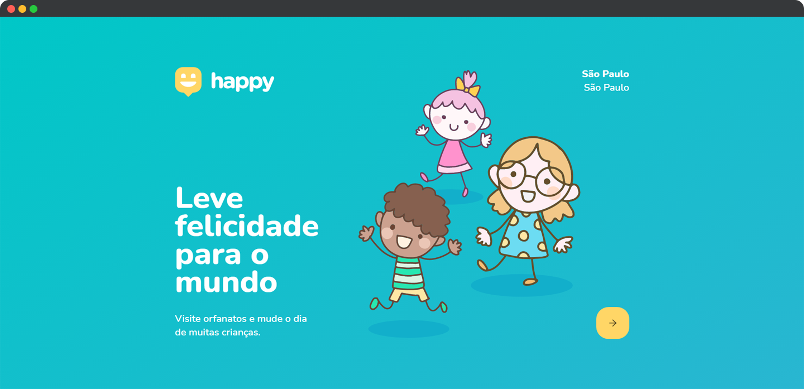

<h1 align="center">
  
</h1>

<p align="center">
  

  
</p>

<br>

<p align="center">
  
</p>

<br>

## 🧪 Tecnologias

Esse projeto foi desenvolvido com as seguintes tecnologias:

- [React](https://reactjs.org)
- [Node.js](https://nodejs.org/en/)
- [React Native](https://facebook.github.io/react-native/)
- [Expo](https://expo.io/)
- [TypeScript](https://www.typescriptlang.org/)

## 💻 Projeto

O Happy é uma aplicação que conecta pessoas à casas de acolhimento institucional.

O Happy foi desenvolvido com motivação pelo Dia das Crianças, pensando em aproximar e conectar pessoas à essas crianças, para tornar o dia delas ainda mais especial.

Este é um projeto desenvolvido durante a **[Next Level Week Together](https://nextlevelweek.com/)**, apresentada nos dias 12 a 16 de Outubro de 2020.

## 🔖 Layout

Você pode visualizar o layout do projeto através do link abaixo:

- [Layout Web](https://www.figma.com/file/mDEbnoojksG4w8sOxmudh3/Happy-Web/duplicate)
- [Layout Mobile](https://www.figma.com/file/X27FfVxAgy9f5IFa7ONlph/Happy-Mobile/duplicate)

É necessário ter uma conta no [Figma](http://figma.com/) para acessá-lo.

## 🚀 Como executar

Clone o projeto e acesse a pasta do mesmo.

```bash
$ git clone https://github.com/rafaelramosdev/nlw-03-omnistack
$ cd nlw-03-omnistack
```

Para iniciá-lo, siga os passos abaixo:
```bash
# Instalar as dependências
$ yarn

#ou

$ npm install

# Iniciar o projeto
$ yarn start

#ou

$ npm start
```
O website estará disponível no seu navegador pelo endereço [`http://localhost:3000`](http://localhost:3000).

## 📄 Licença

Esse projeto está sob a licença MIT. Veja o arquivo [LICENSE](LICENSE) para mais detalhes.

---

Fique ligado nas próximas edições do [Next Level Week](https://nextlevelweek.com/), é um evento gratuito que você não pode deixar passar, recomendo muito!

Feito by [Rafael Ramos](https://rafaelramos.dev/) 🙋🏻‍♂️
